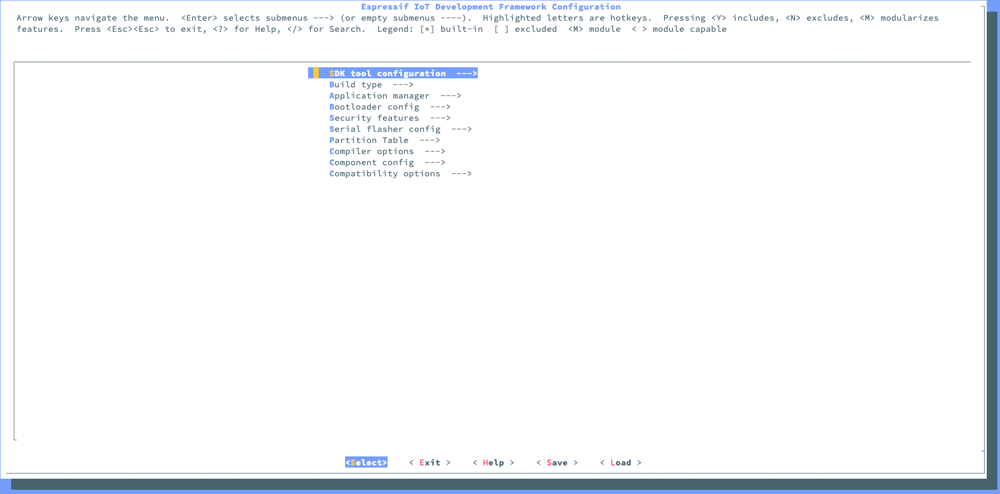

<article>
    <h1>Setup and get started for MacOS Catalina</h1>
</article>
<article>
    <h2>Why</h2>
    
Since I could'nt just follow the basic tutorial and get it to work I created one my myself with all the steps i needed to do to get it working. Works on MacOS Catalina 10.15 as of today's date.

    <h3>Important notice</h3>
    
I have only collected all sources into one guide because I had to install on multiple computers. I'm not the author on any of the sources.

    
The purpose of this guide is to set all up fast and if there is any problems or questions check the sources.

</article>

<h1>Installation</h1>
<article>
    <h2>Step 1. Install prerequisites</h2>
    

        <h3>If XCode isn't installed</h3>
        <ul>
            <li>In terminal: <code>xcode-select --install</code></li>
        </ul>  
    

    

        <h3>Install python</h3>
            
Download and install python 3 from <a href="https://www.python.org">Python.org</a>

            <ul>
                <li>Once done, type in terminal: <code>python3 --version</code></li>
                <li>Example output something similar to: <code>Python 3.7.4</code></li>
                <li>Verify the installation directory: <code>which python3</code></li>
                <li>Example output something similar to: <code>/usr/local/bin/python3</code></li>
            </ul>
    

    

        <h3>Install pip3</h3>
        
Download pip3 from <a href="https://pip.pypa.io/en/stable/installing/">Python.org</a>

        <ul>
            <li>In download location, in terminal: <code>python3 get-pip.py</code></li>
            <li>Verify the installation of pip3: <code>which pip3</code></li>
            <li>Example output something similar to: <code>/usr/local/bin/pip3</code></li>
        </ul>
    

    

        <h3>Usage of pip3</h3>
        
To install python3 packages using pip3, run

        <ul>
            <li>In terminal: <code>pip3 packageName</code></li>
        </ul>  
    

    

        <h3>Install CMake & Ninja build:</h3>
        
If you have <a href="https://brew.sh/">HomeBrew</a>, you can run:

        <ul>
            <li>In terminal: <code>brew install cmake ninja</code></li>
        </ul> 
        
If you have <a href="https://www.macports.org/install.php">MacPorts</a>, you can run:

        <ul>
            <li>In terminal: <code>sudo port install cmake ninja</code></li>
        </ul>
        
Otherwise, consult the <a href="https://cmake.org/">CMake</a> and <a href="https://ninja-build.org/">Ninja</a> home pages for macOS installation downloads.

        
It is strongly recommended to also install <a href="https://ccache.samba.org/">ccache</a> for faster builds.

        <ul>
            <li>HomeBrew: <code>brew install ccache</code></li>
            <li>MacPorts: <code>sudo port install ccache</code></li>
        </ul>
        

</article>
<article>
    <h2>Step 2. Get ESP-IDF</h2>
    
Espressif uses the standard directory "esp" in their guide so we use it here to.

    
In terminal:

    <ul>
        <li><code>cd ~</code></li>
        <li><code>mkdir esp && cd esp</code></li>
        <li><code>git clone --recursive https://github.com/espressif/esp-idf.git</code></li>
    </ul>
    
ESP-IDF will be downloaded into <code>~/esp/esp-idf</code>.

</article>
<article>
    <h2>Step 3. Set up the environment variables</h2>
    
Switched step 3 and 4 around because its not possible to run the command <code>. ./export.sh</code> without valid <code>IDF_PATH</code>.

    
There are different ways to install the <code>IDF_PATH</code> depending on the shell that's in use:

    <h6>Bash</h6>
    
(that is no longer default in MacOS Catalina)

    <ul>
        <li><code>. $HOME/esp/esp-idf/export.sh</code></li>
        <li>Note the space between the leading dot and the path!</li>
        <li>You can also automate this step, making ESP-IDF tools available in every terminal, by adding this line to your <code>.profile</code> or <code>.bash_profile</code> script.</li>
        <li>In terminal: <code>source ~/.profile</code> if changed.</li>
        <li>In terminal: <code>source ~/.bash_profile</code> if changed.</li>
    </ul>
    <h6>Zsh</h6>
    
(default in MacOS Catalina)

    <ul>
        <li>In terminal: <code>echo $IDF_PATH</code></li>
        <li>Should not return anything.</li>
        <li>In terminal: <code>textEditor ~/.zshrc</code> replace textEditor with <a href="https://olivierlacan.com/posts/launch-sublime-text-3-from-the-command-line/">sublime</a>/code/nano or whatever you have installed.</li>
        <li>Add in the bottom oof the file <code>export IDF_PATH=~/esp/esp-idf</code></li>
        <li>In terminal: <code>source ~/.zshrc</code></li>
        <li>In terminal: <code>echo $IDF_PATH</code> should return your path to esp-idf</li>
    </ul>
    <h6>Fish</h6>
    
(with I use)

    <ul>
        <li>In terminal: <code>echo $IDF_PATH</code></li>
        <li>Go into your esp-idf folder and type in terminal <code>pwd</code>, copy the path</li>
        <li>In terminal: <code>set IDF_PATH '/PASTE/YOUR/PATH/HERE/'</code></li>
        <li>Result: <code>set IDF_PATH '/something/esp/esp-idf/'</code></li>
        <li>In terminal: <code>echo $IDF_PATH</code>, should revel your path now</li>
        <li>need to modify file to support fish because export.sh don't work in fish shell</li>
    </ul>
</article>
<article>
    <h2>Step 4. Set up the tools</h2>
    
Aside from the ESP-IDF, you also need to install the tools used by ESP-IDF, such as the compiler, debugger, Python packages, etc.

    
In terminal enter:

    <ul>
        <li><code>~/esp/esp-idf</code></li>
        <li><code>./install.sh</code></li>
    </ul>
    
Should return:

        <ul>
            <li>"All done! You can now run:</li>
            <li><code>. ./export.sh"</code></li>
        </ul>
    
In terminal enter:

    <ul>
        <li><code>. ./export.sh"</code></li>
    </ul>
    
Should return: 

        <ul>
            <li>Done! You can now compile ESP-IDF projects.</li>
            <li>Go to the project directory and run:</li>
            <li><code>idf.py build</code></li>
        </ul>
</article>

    <h1>ExampleProject</h1>
    <article>
        <h2>Step 5. Start a Project</h2>
        
Now you are ready to prepare your application for ESP32. You can start with get-started/hello_world project from examples directory in IDF.

        
Copy <code>get-started/hello_world</code> to <code>~/esp</code> directory:

        
In terminal:

        <ul>
            <li><code>cd ~/esp</code></li>
            <li><code>cp -r $IDF_PATH/examples/get-started/hello_world .</code></li>
        </ul>
        
Or copy the folder in Finder to a new directory.

        
There is a range of example projects in the examples directory in ESP-IDF. You can copy any project in the same way as presented above and run it.

        <h4>Important!</h4>
        
The ESP-IDF build system does not support spaces in the paths to either ESP-IDF or to projects.

    </article>
    <article>
        <h2>Step 6. Connect Your Device</h2>
        
Now connect your ESP32 board to the computer and check under what serial port the board is visible.

        <ul>
            <li>macOS devices starts with: <code>/dev/cu.</code></li>
            <li>List available devices: <code>ls -l /dev/cu.*</code></li>
        </ul>
        
If you cant find your device:

        <ul>
            <li>Check for driver solution <a href="https://docs.espressif.com/projects/esp-idf/en/latest/get-started/establish-serial-connection.html">here</a></li>
            <li>Driver for <a href="https://www.silabs.com/products/development-tools/software/usb-to-uart-bridge-vcp-drivers">CP210x</a></li>
            <li>Driver for <a href="https://www.ftdichip.com/Drivers/VCP.htm">FTDI</a></li>
        </ul>
    </article>
    <article>
        <h2>Step 7. Configure</h2>
        
Navigate to your <code>hello_world</code> directory from Step 5. Start a Project and run the project configuration utility <code>menuconfig</code>.

        
In Terminal:

        <ul>
            <li><code>cd ~/esp/hello_world</code></li>
            <li><code>idf.py menuconfig</code></li>
        </ul>
        
If the previous steps have been done correctly, the following menu appears:

        
    </article>
    <article>
        <h2>Step 8. Build the Project</h2>
        
This step can invoke "Maximum limits (macOS etc.)" problem, that will make the compile to fail. (Source 10, 11, 12)

        
To solve:
        <ul>
            <li>Obtain the current limit: <code>launchctl limit maxfiles</code></li>
            <li>Configuration changes are necessary if lower numbers are displayed, such as: <code>maxfiles 256 unlimited</code></li>
            <li>If the soft limit is too low (such as 256), set the current session to: <code>sudo launchctl limit maxfiles 65536 200000</code></li>
        </ul>
        
Build the project by running:

        <ul><li><code>idf.py build</code></li></ul>
        
This command will compile the application and all ESP-IDF components, then it will generate the bootloader, partition table, and application binaries.

        
If there are no errors, the build will finish by generating the firmware binary <code>.bin</code> file.

    </article>

<article>
    <h2>Sources:</h2>
    <ol>
        <li><a href="https://docs.espressif.com/projects/esp-idf/en/latest/get-started/index.html#get-started-get-esp-idf">get-started-get-esp-idf</a></li>
        <li><a href="https://evansdianga.com/install-pip-osx/">install-pip-osx</a></li>
        <li><a href="https://www.youtube.com/watch?time_continue=4&v=KRyvly_SYS8">Get started with ESP32 on Visual Studio Code for Windows 10</a></li>
        <li><a href="https://fishshell.com/docs/current/tutorial.html#tut_path">Fish tutorial PATH</a></li>
        <li><a href="https://stackoverflow.com/questions/26208231/modifying-path-with-fish-shell">modifying-path-with-fish-shell</a></li>
        <li><a href="https://stackoverflow.com/questions/11530090/adding-a-new-entry-to-the-path-variable-in-zsh">adding-a-new-entry-to-the-path-variable-in-zsh</a></li>
        <li><a href="https://github.com/sparks/dotfiles/blob/master/.config/fish/config.fish">config.fish</a></li>
        <li><a href="https://olivierlacan.com/posts/launch-sublime-text-3-from-the-command-line/">launch-sublime-text-3-from-the-command-line</a></li>
        <li><a href="https://randomnerdtutorials.com/installing-the-esp32-board-in-arduino-ide-windows-instructions/">installing-the-esp32-board-in-arduino-ide-windows-instructions</a></li>
        <li><a href="https://github.com/espressif/esp-idf/issues/3989">Invoking idf.py build on a custom project fails to compile</a></li>
        <li><a href="https://wilsonmar.github.io/maximum-limits/">maximum-limits</a></li>
        <li><a href="https://github.com/wilsonmar/mac-setup/blob/master/configs/limit.maxfiles.plist">limit.maxfiles.plist</a></li>
    </ol>
</article>